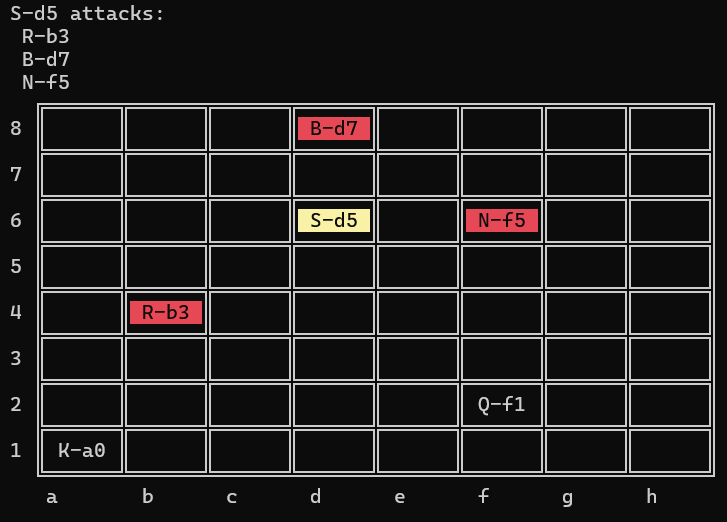

# Решение тестового задания PetroGM

Необходимо разработать программу, которая размещает на шахматной доске фигуры и проверяет бьют ли они друг друга.

## Запуск
```sh
dotnet build
.\PetroGMTest.Console\bin\Debug\net9.0\PetroGMTest.Console.exe <input.txt> [-d, --detailed]
.\PetroGMTest.Console\bin\Debug\net9.0\PetroGMTest.Console.exe .\Tests\Test01.txt 
```

### Пример корректного входного файла
```txt
king 0 0
queen 5 1
rook 1 3
bishop 3 7
knight  5 5
shadow 3 5
```

#### Вывод:

```
  ╔══════╦══════╦══════╦══════╦══════╦══════╦══════╦══════╗
8 ║      ║      ║      ║ B-d8 ║      ║      ║      ║      ║
  ╠══════╬══════╬══════╬══════╬══════╬══════╬══════╬══════╣
7 ║      ║      ║      ║      ║      ║      ║      ║      ║
  ╠══════╬══════╬══════╬══════╬══════╬══════╬══════╬══════╣
6 ║      ║      ║      ║ S-d6 ║      ║ N-f6 ║      ║      ║
  ╠══════╬══════╬══════╬══════╬══════╬══════╬══════╬══════╣
5 ║      ║      ║      ║      ║      ║      ║      ║      ║
  ╠══════╬══════╬══════╬══════╬══════╬══════╬══════╬══════╣
4 ║      ║ R-b4 ║      ║      ║      ║      ║      ║      ║
  ╠══════╬══════╬══════╬══════╬══════╬══════╬══════╬══════╣
3 ║      ║      ║      ║      ║      ║      ║      ║      ║
  ╠══════╬══════╬══════╬══════╬══════╬══════╬══════╬══════╣
2 ║      ║      ║      ║      ║      ║ Q-f2 ║      ║      ║
  ╠══════╬══════╬══════╬══════╬══════╬══════╬══════╬══════╣
1 ║ K-a1 ║      ║      ║      ║      ║      ║      ║      ║
  ╚══════╩══════╩══════╩══════╩══════╩══════╩══════╩══════╝
   a       b      c      d      e      f      g      h
Q-f2 attacks:
 N-f6

B-d8 attacks:
 N-f6

S-d6 attacks:
 R-b4
 B-d8
 N-f6
```

### Пример некорректного входного файла
```txt
King 0 0
Killer 1 2
Pawn 2 1
rook 1 
queen  1 $
rook
bishop 32 7
knight  5 5
shadow 3 5
```

#### Вывод:

```
Errors: [6]
- Line 2: Unknown piece type 'killer'
- Line 3: Unknown piece type 'pawn'
- Line 4: is not valid: rook 1 
- Line 5: invalid coordinates: queen  1 $
- Line 6: is not valid: rook
- Line 7: Coordinates (32, 7) out of bounds.
  ╔══════╦══════╦══════╦══════╦══════╦══════╦══════╦══════╗
8 ║      ║      ║      ║      ║      ║      ║      ║      ║
  ╠══════╬══════╬══════╬══════╬══════╬══════╬══════╬══════╣
7 ║      ║      ║      ║      ║      ║      ║      ║      ║
  ╠══════╬══════╬══════╬══════╬══════╬══════╬══════╬══════╣
6 ║      ║      ║      ║ S-d6 ║      ║ N-f6 ║      ║      ║
  ╠══════╬══════╬══════╬══════╬══════╬══════╬══════╬══════╣
5 ║      ║      ║      ║      ║      ║      ║      ║      ║
  ╠══════╬══════╬══════╬══════╬══════╬══════╬══════╬══════╣
4 ║      ║      ║      ║      ║      ║      ║      ║      ║
  ╠══════╬══════╬══════╬══════╬══════╬══════╬══════╬══════╣
3 ║      ║      ║      ║      ║      ║      ║      ║      ║
  ╠══════╬══════╬══════╬══════╬══════╬══════╬══════╬══════╣
2 ║      ║      ║      ║      ║      ║      ║      ║      ║
  ╠══════╬══════╬══════╬══════╬══════╬══════╬══════╬══════╣
1 ║ K-a1 ║      ║      ║      ║      ║      ║      ║      ║
  ╚══════╩══════╩══════╩══════╩══════╩══════╩══════╩══════╝
   a       b      c      d      e      f      g      h
S-d6 attacks:
 N-f6
```

## Опция [-d, --detailed]
Выводит визуально жёлтым цветом атакующую фигуру и фигуры, которые она атакует, красным


